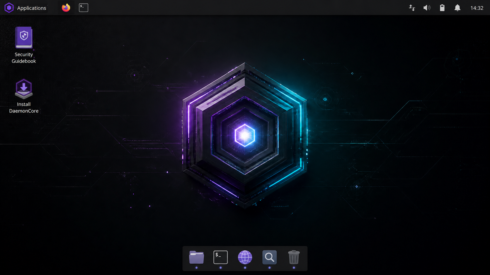
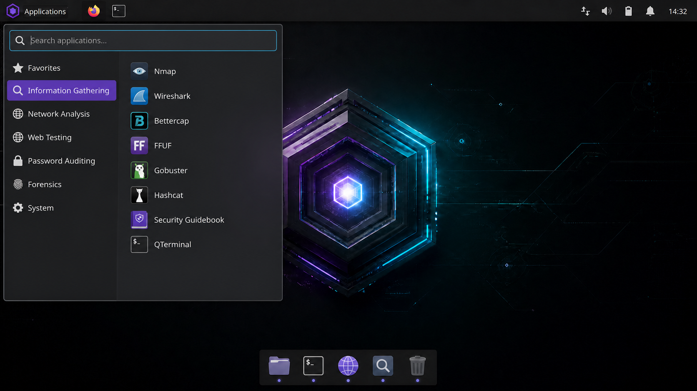

# DaemonCore Linux


DaemonCore Linux is a Debian-based XFCE live system for **authorized security
testing, defensive validation, incident response, and security education**.
The image is assembled from source with Debian's `live-build` tooling.

## Desktop preview





These are design previews using the real Core Horizon wallpaper, not screenshots
from a boot-tested ISO. See [SCREENSHOTS.md](SCREENSHOTS.md) for details.

## First release profile

- Lightweight XFCE desktop
- Live boot on 64-bit UEFI and legacy BIOS systems
- Optional persistence when the USB is prepared with a persistence partition
- Calamares graphical installer launcher
- Non-root live session with `sudo`
- Network analysis, discovery, web assessment, password auditing, reverse
  engineering, and forensic utilities
- Firewall enabled by default
- No embedded credentials, payloads, exploits, or untrusted binary downloads

See [APPLICATIONS.md](APPLICATIONS.md) for the complete categorized manifest
of explicitly included software.

DaemonCore also ships with five original wallpapers and two selectable dark
GTK themes. See [THEMING.md](THEMING.md) for previews and customization details.

An offline Security Guidebook is available from the desktop and Applications
menu. Its lab-focused guides live in
`config/includes.chroot/usr/share/doc/daemoncore/guidebook/`.

## Build requirements

Build on Debian Stable, or in a Debian Stable virtual machine/container. The
build host needs at least 25 GB free disk space and roughly 4 GB RAM.

```bash
sudo apt update
sudo apt install live-build debootstrap squashfs-tools xorriso isolinux syslinux-common
```

## Build the ISO

```bash
cd daemoncore-linux
sudo sh ./build.sh
```

The finished image is copied to `dist/daemoncore-amd64.iso`. Build logs and
live-build artifacts remain under `.build/`.

To remove generated build artifacts:

```bash
sudo sh ./clean.sh
```

## Test safely

Test in a VM before writing the image to USB. A reasonable starting VM has two
CPU cores, 4 GB RAM, a 40 GB virtual disk, and an isolated or NAT-only network.

```bash
qemu-system-x86_64 \
  -enable-kvm -m 4096 -smp 2 \
  -cdrom dist/daemoncore-amd64.iso \
  -drive file=daemoncore-test.qcow2,format=qcow2
```

Verify the checksum created beside the ISO:

```bash
sha256sum -c dist/daemoncore-amd64.iso.sha256
```

## Customize

- Packages: `config/package-lists/daemoncore.list.chroot`
- Desktop defaults: `config/includes.chroot/etc/skel/`
- System identity: `config/includes.chroot/etc/`
- First-boot hardening: `config/hooks/live/0200-daemoncore-hardening.hook.chroot`
- Build parameters: `auto/config`

The `stable` suite currently resolves to Debian 13 (Trixie). Using the suite
alias keeps security updates flowing, but major Debian releases can change the
package set. Pin a codename in `auto/config` when release-to-release output must
remain identical.

Only test systems you own or have explicit permission to assess.
