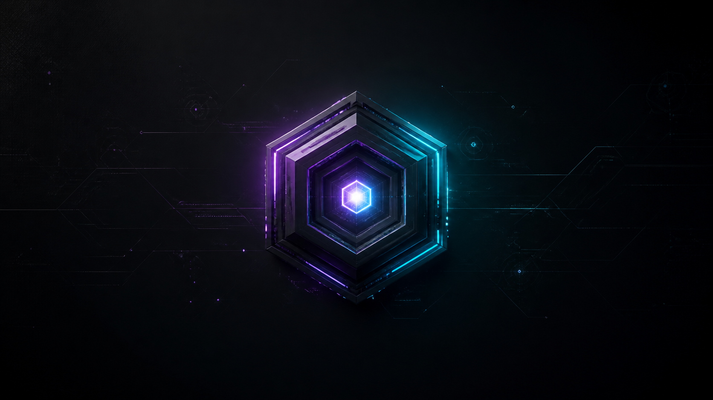
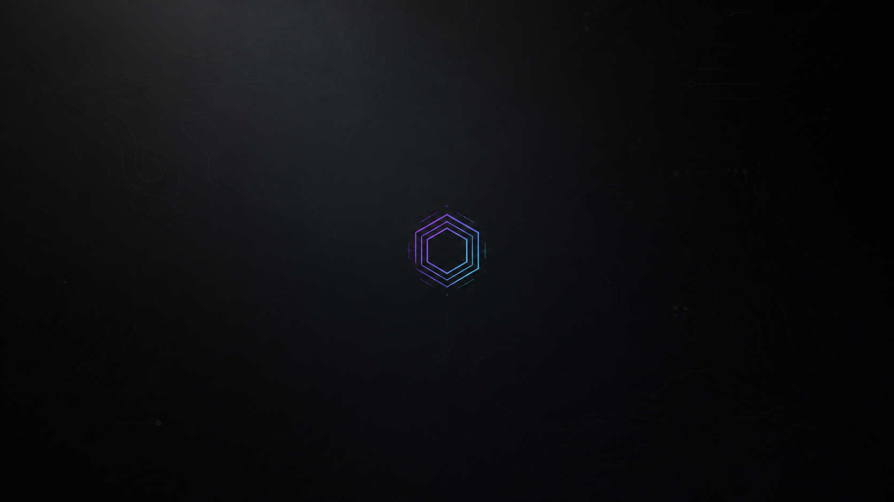
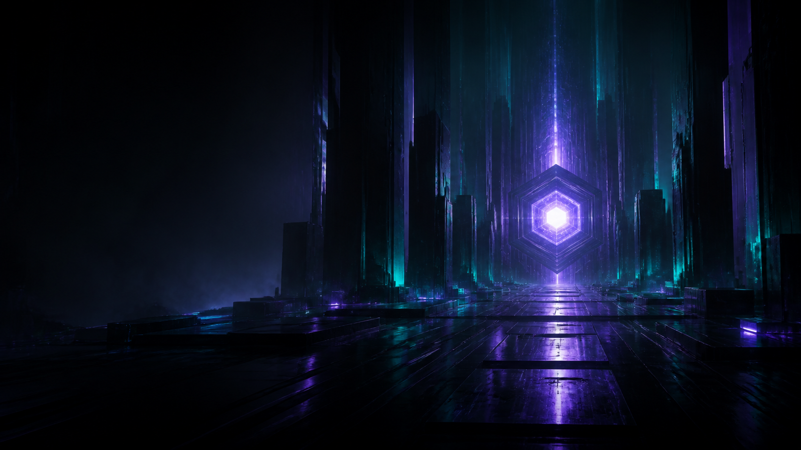
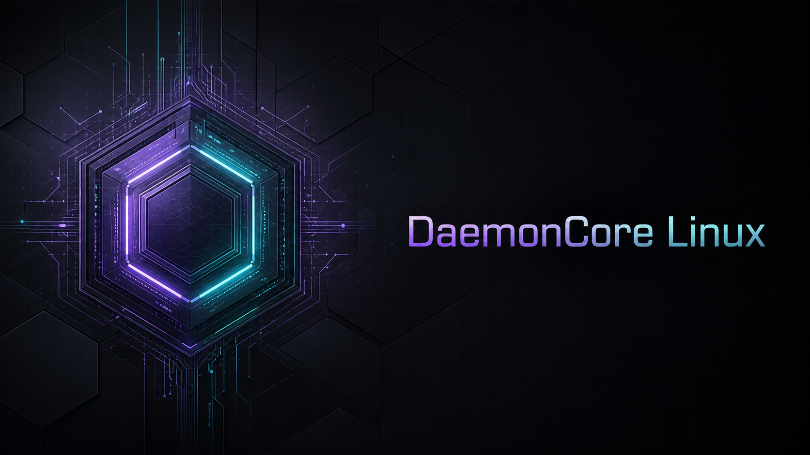
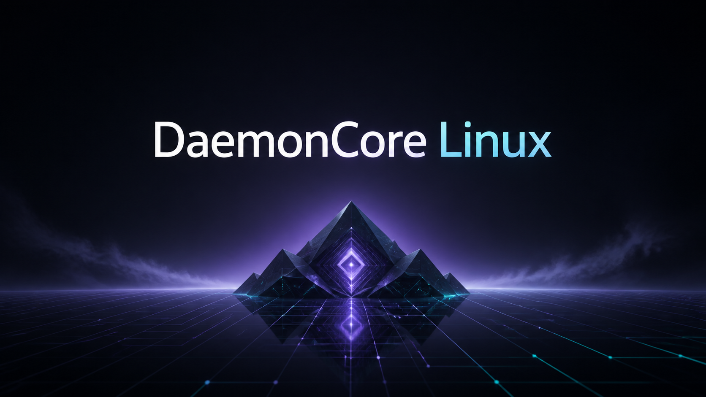

# DaemonCore visual themes

DaemonCore Linux includes a coordinated violet-and-teal visual identity for
the XFCE desktop and LightDM login screen.

## Wallpapers

### Core Horizon

The default desktop and login wallpaper. A layered central core with balanced
violet and teal illumination.

### Silent Grid

A minimal, low-distraction option for long desktop sessions.

### Neon Citadel

A cinematic option for demonstrations and live-session screenshots.

### Core Signal

A branded circuit-core design with a spacious layout and prominent
DaemonCore Linux title.

### Midnight Protocol

A calm geometric horizon with a centered DaemonCore Linux title for everyday
desktop use.

Inside DaemonCore, select a wallpaper from **Desktop Settings → Background**.
The files are installed in `/usr/share/backgrounds/daemoncore/`.

## GTK themes

- **DaemonCore Dark** is the default graphite theme with violet selection and
  teal focus accents.
- **DaemonCore Black** is a higher-contrast near-black alternative with cyan
  highlights.

Switch themes from **Settings → Appearance → Style**. Theme files are installed
under `/usr/share/themes/` and inherit Debian's maintained Adwaita Dark base.
